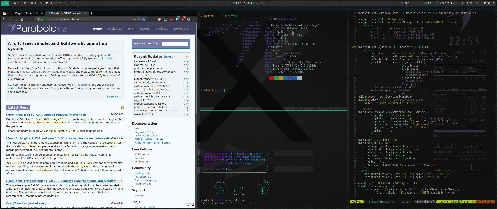

# dotfiles


These configuration files are managed with the tool GNU Stow:

     Stow is a tool for managing the installation of multiple software packages
     in the same run-time directory tree. One historical difficulty of this task
     has been the need to administer, upgrade, install, and remove files in
     independent packages without confusing them with other files sharing the
     same filesystem space.


### Quick Reference:

- `-t DIR` Set the target directory
- `-R` Restow packages that follow this option
- `-D` Unstow the packages that follow this option

For more info look at `man stow`.

### Examples

To add folder:

```bash
stow <FOLDER> -t ~
```

To remove:

```bash
stow -D <FOLDER> -t ~

### Screenshot


